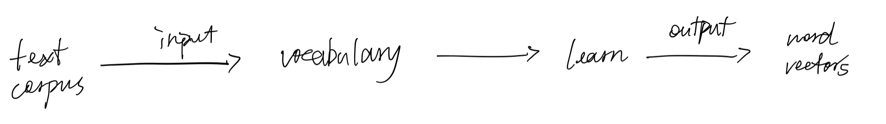
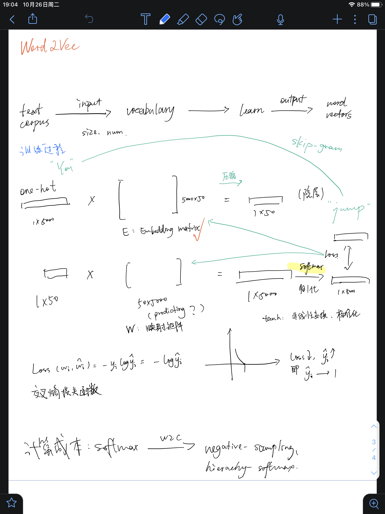

# Week 3

## 1 论文+代码

```sh
florrie@Florries-mbp Automatic-Server-Logs-Clustering--master % python3 cluster.py
87675
1050
preprocessing finished......
(87675, 2503) (1050, 2503)  #print(tfidf_vectors.shape,tfidf_vectors_test.shape)

```

```The distortion is computed as the the sum of the squared distances betweeneach observation and its closest centroid. Logically, this is the metricthat K-Means attempts to minimize as it is fitting the model.```


## 2 Wor2Vec by Google

[google官方Word2Vec文档](https://code.google.com/archive/p/word2vec/)

### 2.1 How does it work

The *word2vec* tool takes a text corpus as input and produces the word vectors as output. It first constructs a vocabulary from the training text data and then learns vector representation of words. 

2个主要的学习算法：CBOW/skip-gram；switch “ -cbow ”



采取skip-gram算法的示例：



### 2.2 What can it do

* **找距离近的词**：cos distance


* **Word clustering**：

The word vectors can be also used for deriving word classes from huge data sets. This is achieved by performing K-means clustering on top of the word vectors. The script that demonstrates this is *./demo-classes.sh*. The output is a vocabulary file with words and their corresponding class IDs, such as:


### 2.3 Perfomance

Several factors influence the quality of the word vectors: 

* amount and quality of the training data 
* size of the vectors 
* training algorithm

The training speed can be significantly improved by using parallel training on multiple-CPU machine (use the switch '-threads N'). The hyper-parameter choice is crucial for performance (both speed and accuracy), however varies for different applications. The main choices to make are:

- architecture: skip-gram (slower, better for infrequent words) vs CBOW (fast)
- the training algorithm: hierarchical softmax (better for infrequent words) vs negative sampling (better for frequent words, better with low dimensional vectors)
- sub-sampling of frequent words: can improve both accuracy and speed for large data sets (useful values are in range 1e-3 to 1e-5)
- dimensionality of the word vectors: usually more is better, but not always
- context (window) size: for skip-gram usually around 10, for CBOW around 5

```Unfortunately, the model is unable to infer vectors for unfamiliar words. This is one limitation of Word2Vec: if this limitation matters to you, check out the FastText model.```

### 2.4 Google的预训练模型

在文档```W2V_pretrained_model - Jupyter Notebook.pdf```中


## 3 Word2Vec实现·基于gensim

### 3.1 [gensim.model.word2vec.Word2Vec( )](https://radimrehurek.com/gensim/models/word2vec.html#gensim.models.word2vec.Word2Vec)

- **vector_size** (*int**,* *optional*) – Dimensionality of the word vectors.(Formerly: size)
- **window** (*int**,* *optional*) – Maximum distance between the current and predicted word within a sentence.
- **min_count** (*int**,* *optional*) – Ignores all words with total frequency lower than this.
- **workers** (*int**,* *optional*) – Use these many worker threads to train the model (=faster training with multicore machines).
- **sg** (*{0**,* *1}**,* *optional*) – Training algorithm: 1 for skip-gram; otherwise CBOW.
- **hs** (*{0**,* *1}**,* *optional*) – If 1, hierarchical softmax will be used for model training. If 0, and negative is non-zero, negative sampling will be used.
- **negative** (*int**,* *optional*) – If > 0, negative sampling will be used, the int for negative specifies how many “noise words” should be drawn (usually between 5-20). If set to 0, no negative sampling is used.
- **epochs** (*int**,* *optional*) – Number of iterations (epochs) over the corpus. (Formerly: iter)

```
在Text8语料库上进行训练，并在给定的WordSim353数据集上进行测试。
```

**[text8](http://mattmahoney.net/dc/textdata.html)语料** : a quick test on 100 MB of cleaned  Wiki text

[100MB上传到仓库中还是很大、所以上传文件中不包含text8，请在这里下载text8](http://mattmahoney.net/dc/text8.zip)！

**WordSim353** : 是一个词语相似度基准数据集，在WordSim353数据集中，表格的第一、二列是一对单词，第三列中是该单词对的相似度的人工打分(第三列也已经被单独抽出为ground_truth.npy)。我们需要用我们训练得到的词向量对单词相似度进行打分，并与人工打分计算相关性系数，总的来说，越高的相关性系数代表越好的词向量质量。

**word2vec.py运行**：

```
### index: 0  vector_size: 200  window: 10  min_count: 10  negative: 10
2021-10-23 22:28:45,702 : INFO : collecting all words and their counts
2021-10-23 22:28:45,704 : INFO : PROGRESS: at sentence #0, processed 0 words, keeping 0 word types
2021-10-23 22:28:50,555 : INFO : collected 253854 word types from a corpus of 17005207 raw words and 1701 sentences
2021-10-23 22:28:50,555 : INFO : Creating a fresh vocabulary
2021-10-23 22:28:50,900 : INFO : Word2Vec lifecycle event {'msg': 'effective_min_count=10 retains 47134 unique words (18.56736549355141%% of original 253854, drops 206720)', 'datetime': '2021-10-23T22:28:50.846194', 'gensim': '4.1.2', 'python': '3.9.0 (v3.9.0:9cf6752276, Oct  5 2020, 11:29:23) \n[Clang 6.0 (clang-600.0.57)]', 'platform': 'macOS-10.16-x86_64-i386-64bit', 'event': 'prepare_vocab'}
2021-10-23 22:28:50,901 : INFO : Word2Vec lifecycle event {'msg': 'effective_min_count=10 leaves 16561031 word corpus (97.38800004022298%% of original 17005207, drops 444176)', 'datetime': '2021-10-23T22:28:50.901352', 'gensim': '4.1.2', 'python': '3.9.0 (v3.9.0:9cf6752276, Oct  5 2020, 11:29:23) \n[Clang 6.0 (clang-600.0.57)]', 'platform': 'macOS-10.16-x86_64-i386-64bit', 'event': 'prepare_vocab'}
2021-10-23 22:28:51,220 : INFO : deleting the raw counts dictionary of 253854 items
2021-10-23 22:28:51,231 : INFO : sample=0.001 downsamples 38 most-common words
2021-10-23 22:28:51,231 : INFO : Word2Vec lifecycle event {'msg': 'downsampling leaves estimated 12333563.370024087 word corpus (74.5%% of prior 16561031)', 'datetime': '2021-10-23T22:28:51.231904', 'gensim': '4.1.2', 'python': '3.9.0 (v3.9.0:9cf6752276, Oct  5 2020, 11:29:23) \n[Clang 6.0 (clang-600.0.57)]', 'platform': 'macOS-10.16-x86_64-i386-64bit', 'event': 'prepare_vocab'}
2021-10-23 22:28:51,679 : INFO : estimated required memory for 47134 words and 200 dimensions: 98981400 bytes
2021-10-23 22:28:51,679 : INFO : resetting layer weights
2021-10-23 22:28:51,732 : INFO : Word2Vec lifecycle event {'update': False, 'trim_rule': 'None', 'datetime': '2021-10-23T22:28:51.732898', 'gensim': '4.1.2', 'python': '3.9.0 (v3.9.0:9cf6752276, Oct  5 2020, 11:29:23) \n[Clang 6.0 (clang-600.0.57)]', 'platform': 'macOS-10.16-x86_64-i386-64bit', 'event': 'build_vocab'}
2021-10-23 22:28:51,733 : INFO : Word2Vec lifecycle event {'msg': 'training model with 8 workers on 47134 vocabulary and 200 features, using sg=0 hs=0 sample=0.001 negative=10 window=10 shrink_windows=True', 'datetime': '2021-10-23T22:28:51.733133', 'gensim': '4.1.2', 'python': '3.9.0 (v3.9.0:9cf6752276, Oct  5 2020, 11:29:23) \n[Clang 6.0 (clang-600.0.57)]', 'platform': 'macOS-10.16-x86_64-i386-64bit', 'event': 'train'}
2021-10-23 22:28:52,740 : INFO : EPOCH 1 - PROGRESS: at 7.76% examples, 944097 words/s, in_qsize 14, out_qsize 1
2021-10-23 22:28:53,742 : INFO : EPOCH 1 - PROGRESS: at 16.23% examples, 990733 words/s, in_qsize 14, out_qsize 1
2021-10-23 22:28:54,748 : INFO : EPOCH 1 - PROGRESS: at 24.10% examples, 984574 words/s, in_qsize 14, out_qsize 1
2021-10-23 22:28:55,749 : INFO : EPOCH 1 - PROGRESS: at 32.39% examples, 996204 words/s, in_qsize 14, out_qsize 0
2021-10-23 22:28:56,760 : INFO : EPOCH 1 - PROGRESS: at 40.45% examples, 994637 words/s, in_qsize 14, out_qsize 1
2021-10-23 22:28:57,768 : INFO : EPOCH 1 - PROGRESS: at 47.97% examples, 983201 words/s, in_qsize 14, out_qsize 1
2021-10-23 22:28:58,776 : INFO : EPOCH 1 - PROGRESS: at 55.26% examples, 970799 words/s, in_qsize 15, out_qsize 0
2021-10-23 22:28:59,799 : INFO : EPOCH 1 - PROGRESS: at 62.49% examples, 958390 words/s, in_qsize 11, out_qsize 2
2021-10-23 22:29:00,800 : INFO : EPOCH 1 - PROGRESS: at 70.25% examples, 958462 words/s, in_qsize 13, out_qsize 0
2021-10-23 22:29:01,811 : INFO : EPOCH 1 - PROGRESS: at 77.90% examples, 954516 words/s, in_qsize 12, out_qsize 0
2021-10-23 22:29:02,823 : INFO : EPOCH 1 - PROGRESS: at 86.01% examples, 957472 words/s, in_qsize 14, out_qsize 1
2021-10-23 22:29:03,837 : INFO : EPOCH 1 - PROGRESS: at 94.06% examples, 958937 words/s, in_qsize 15, out_qsize 0
2021-10-23 22:29:04,551 : INFO : worker thread finished; awaiting finish of 7 more threads
2021-10-23 22:29:04,557 : INFO : worker thread finished; awaiting finish of 6 more threads
2021-10-23 22:29:04,568 : INFO : worker thread finished; awaiting finish of 5 more threads
2021-10-23 22:29:04,568 : INFO : worker thread finished; awaiting finish of 4 more threads
2021-10-23 22:29:04,572 : INFO : worker thread finished; awaiting finish of 3 more threads
2021-10-23 22:29:04,573 : INFO : worker thread finished; awaiting finish of 2 more threads
2021-10-23 22:29:04,580 : INFO : worker thread finished; awaiting finish of 1 more threads
2021-10-23 22:29:04,588 : INFO : worker thread finished; awaiting finish of 0 more threads
2021-10-23 22:29:04,589 : INFO : EPOCH - 1 : training on 17005207 raw words (12333145 effective words) took 12.9s, 959493 effective words/s
2021-10-23 22:29:05,622 : INFO : EPOCH 2 - PROGRESS: at 7.58% examples, 899518 words/s, in_qsize 15, out_qsize 1
2021-10-23 22:29:06,623 : INFO : EPOCH 2 - PROGRESS: at 15.87% examples, 956861 words/s, in_qsize 15, out_qsize 0
2021-10-23 22:29:07,636 : INFO : EPOCH 2 - PROGRESS: at 23.63% examples, 954677 words/s, in_qsize 15, out_qsize 0
2021-10-23 22:29:08,641 : INFO : EPOCH 2 - PROGRESS: at 31.33% examples, 954910 words/s, in_qsize 15, out_qsize 0
2021-10-23 22:29:09,657 : INFO : EPOCH 2 - PROGRESS: at 38.57% examples, 940895 words/s, in_qsize 12, out_qsize 3
2021-10-23 22:29:10,668 : INFO : EPOCH 2 - PROGRESS: at 45.27% examples, 921044 words/s, in_qsize 11, out_qsize 0
2021-10-23 22:29:11,673 : INFO : EPOCH 2 - PROGRESS: at 52.62% examples, 918796 words/s, in_qsize 16, out_qsize 0
2021-10-23 22:29:12,681 : INFO : EPOCH 2 - PROGRESS: at 59.67% examples, 912404 words/s, in_qsize 14, out_qsize 1
2021-10-23 22:29:13,681 : INFO : EPOCH 2 - PROGRESS: at 66.20% examples, 900719 words/s, in_qsize 14, out_qsize 1
2021-10-23 22:29:14,682 : INFO : EPOCH 2 - PROGRESS: at 73.31% examples, 898837 words/s, in_qsize 15, out_qsize 0
2021-10-23 22:29:15,698 : INFO : EPOCH 2 - PROGRESS: at 80.13% examples, 890754 words/s, in_qsize 16, out_qsize 0
2021-10-23 22:29:16,713 : INFO : EPOCH 2 - PROGRESS: at 86.89% examples, 884745 words/s, in_qsize 14, out_qsize 1
2021-10-23 22:29:17,715 : INFO : EPOCH 2 - PROGRESS: at 94.12% examples, 885046 words/s, in_qsize 12, out_qsize 0
2021-10-23 22:29:18,492 : INFO : worker thread finished; awaiting finish of 7 more threads
2021-10-23 22:29:18,507 : INFO : worker thread finished; awaiting finish of 6 more threads
2021-10-23 22:29:18,508 : INFO : worker thread finished; awaiting finish of 5 more threads
2021-10-23 22:29:18,510 : INFO : worker thread finished; awaiting finish of 4 more threads
2021-10-23 22:29:18,514 : INFO : worker thread finished; awaiting finish of 3 more threads
2021-10-23 22:29:18,514 : INFO : worker thread finished; awaiting finish of 2 more threads
2021-10-23 22:29:18,520 : INFO : worker thread finished; awaiting finish of 1 more threads
2021-10-23 22:29:18,528 : INFO : worker thread finished; awaiting finish of 0 more threads
2021-10-23 22:29:18,528 : INFO : EPOCH - 2 : training on 17005207 raw words (12334864 effective words) took 13.9s, 885027 effective words/s
2021-10-23 22:29:19,535 : INFO : EPOCH 3 - PROGRESS: at 6.94% examples, 842895 words/s, in_qsize 12, out_qsize 0
2021-10-23 22:29:20,538 : INFO : EPOCH 3 - PROGRESS: at 14.58% examples, 889058 words/s, in_qsize 15, out_qsize 0
2021-10-23 22:29:21,539 : INFO : EPOCH 3 - PROGRESS: at 22.28% examples, 908871 words/s, in_qsize 13, out_qsize 0
2021-10-23 22:29:22,558 : INFO : EPOCH 3 - PROGRESS: at 30.22% examples, 925466 words/s, in_qsize 15, out_qsize 0
2021-10-23 22:29:23,568 : INFO : EPOCH 3 - PROGRESS: at 37.74% examples, 926011 words/s, in_qsize 13, out_qsize 2
2021-10-23 22:29:24,576 : INFO : EPOCH 3 - PROGRESS: at 45.39% examples, 927912 words/s, in_qsize 13, out_qsize 2
2021-10-23 22:29:25,581 : INFO : EPOCH 3 - PROGRESS: at 53.38% examples, 936128 words/s, in_qsize 14, out_qsize 1
2021-10-23 22:29:26,595 : INFO : EPOCH 3 - PROGRESS: at 61.08% examples, 936928 words/s, in_qsize 14, out_qsize 1
2021-10-23 22:29:27,603 : INFO : EPOCH 3 - PROGRESS: at 67.49% examples, 919979 words/s, in_qsize 15, out_qsize 0
2021-10-23 22:29:28,607 : INFO : EPOCH 3 - PROGRESS: at 74.13% examples, 910167 words/s, in_qsize 15, out_qsize 0
2021-10-23 22:29:29,616 : INFO : EPOCH 3 - PROGRESS: at 81.13% examples, 903406 words/s, in_qsize 14, out_qsize 1
2021-10-23 22:29:30,630 : INFO : EPOCH 3 - PROGRESS: at 88.01% examples, 897622 words/s, in_qsize 13, out_qsize 2
2021-10-23 22:29:31,632 : INFO : EPOCH 3 - PROGRESS: at 95.00% examples, 894634 words/s, in_qsize 15, out_qsize 0
2021-10-23 22:29:32,203 : INFO : worker thread finished; awaiting finish of 7 more threads
2021-10-23 22:29:32,204 : INFO : worker thread finished; awaiting finish of 6 more threads
2021-10-23 22:29:32,216 : INFO : worker thread finished; awaiting finish of 5 more threads
2021-10-23 22:29:32,216 : INFO : worker thread finished; awaiting finish of 4 more threads
2021-10-23 22:29:32,218 : INFO : worker thread finished; awaiting finish of 3 more threads
2021-10-23 22:29:32,222 : INFO : worker thread finished; awaiting finish of 2 more threads
2021-10-23 22:29:32,230 : INFO : worker thread finished; awaiting finish of 1 more threads
2021-10-23 22:29:32,231 : INFO : worker thread finished; awaiting finish of 0 more threads
2021-10-23 22:29:32,231 : INFO : EPOCH - 3 : training on 17005207 raw words (12333146 effective words) took 13.7s, 900162 effective words/s
2021-10-23 22:29:33,237 : INFO : EPOCH 4 - PROGRESS: at 6.64% examples, 808837 words/s, in_qsize 15, out_qsize 0
2021-10-23 22:29:34,240 : INFO : EPOCH 4 - PROGRESS: at 13.64% examples, 832421 words/s, in_qsize 16, out_qsize 0
2021-10-23 22:29:35,247 : INFO : EPOCH 4 - PROGRESS: at 21.40% examples, 871582 words/s, in_qsize 15, out_qsize 0
2021-10-23 22:29:36,249 : INFO : EPOCH 4 - PROGRESS: at 28.92% examples, 887705 words/s, in_qsize 12, out_qsize 0
2021-10-23 22:29:37,261 : INFO : EPOCH 4 - PROGRESS: at 36.68% examples, 901647 words/s, in_qsize 15, out_qsize 0
2021-10-23 22:29:38,272 : INFO : EPOCH 4 - PROGRESS: at 42.39% examples, 867517 words/s, in_qsize 14, out_qsize 1
2021-10-23 22:29:39,278 : INFO : EPOCH 4 - PROGRESS: at 48.74% examples, 855383 words/s, in_qsize 15, out_qsize 1
2021-10-23 22:29:40,294 : INFO : EPOCH 4 - PROGRESS: at 55.03% examples, 844235 words/s, in_qsize 9, out_qsize 7
2021-10-23 22:29:41,303 : INFO : EPOCH 4 - PROGRESS: at 62.73% examples, 855349 words/s, in_qsize 16, out_qsize 0
2021-10-23 22:29:42,310 : INFO : EPOCH 4 - PROGRESS: at 69.49% examples, 852837 words/s, in_qsize 14, out_qsize 1
2021-10-23 22:29:43,319 : INFO : EPOCH 4 - PROGRESS: at 75.01% examples, 836756 words/s, in_qsize 11, out_qsize 2
2021-10-23 22:29:44,326 : INFO : EPOCH 4 - PROGRESS: at 81.42% examples, 831120 words/s, in_qsize 10, out_qsize 0
2021-10-23 22:29:45,327 : INFO : EPOCH 4 - PROGRESS: at 87.54% examples, 825034 words/s, in_qsize 12, out_qsize 0
2021-10-23 22:29:46,356 : INFO : EPOCH 4 - PROGRESS: at 93.36% examples, 815683 words/s, in_qsize 12, out_qsize 1
2021-10-23 22:29:47,373 : INFO : EPOCH 4 - PROGRESS: at 99.06% examples, 807018 words/s, in_qsize 15, out_qsize 1
2021-10-23 22:29:47,432 : INFO : worker thread finished; awaiting finish of 7 more threads
2021-10-23 22:29:47,452 : INFO : worker thread finished; awaiting finish of 6 more threads
2021-10-23 22:29:47,455 : INFO : worker thread finished; awaiting finish of 5 more threads
2021-10-23 22:29:47,455 : INFO : worker thread finished; awaiting finish of 4 more threads
2021-10-23 22:29:47,459 : INFO : worker thread finished; awaiting finish of 3 more threads
2021-10-23 22:29:47,459 : INFO : worker thread finished; awaiting finish of 2 more threads
2021-10-23 22:29:47,469 : INFO : worker thread finished; awaiting finish of 1 more threads
2021-10-23 22:29:47,473 : INFO : worker thread finished; awaiting finish of 0 more threads
2021-10-23 22:29:47,473 : INFO : EPOCH - 4 : training on 17005207 raw words (12333709 effective words) took 15.2s, 809291 effective words/s
2021-10-23 22:29:48,491 : INFO : EPOCH 5 - PROGRESS: at 5.23% examples, 634485 words/s, in_qsize 14, out_qsize 1
2021-10-23 22:29:49,494 : INFO : EPOCH 5 - PROGRESS: at 12.23% examples, 741111 words/s, in_qsize 15, out_qsize 0
2021-10-23 22:29:50,562 : INFO : EPOCH 5 - PROGRESS: at 19.11% examples, 759347 words/s, in_qsize 15, out_qsize 0
2021-10-23 22:29:51,566 : INFO : EPOCH 5 - PROGRESS: at 26.40% examples, 794426 words/s, in_qsize 11, out_qsize 0
2021-10-23 22:29:52,582 : INFO : EPOCH 5 - PROGRESS: at 32.98% examples, 797390 words/s, in_qsize 14, out_qsize 2
2021-10-23 22:29:53,586 : INFO : EPOCH 5 - PROGRESS: at 39.39% examples, 796587 words/s, in_qsize 11, out_qsize 0
2021-10-23 22:29:54,594 : INFO : EPOCH 5 - PROGRESS: at 44.91% examples, 779926 words/s, in_qsize 14, out_qsize 1
2021-10-23 22:29:55,610 : INFO : EPOCH 5 - PROGRESS: at 51.09% examples, 776370 words/s, in_qsize 16, out_qsize 0
2021-10-23 22:29:56,614 : INFO : EPOCH 5 - PROGRESS: at 57.91% examples, 783616 words/s, in_qsize 16, out_qsize 0
2021-10-23 22:29:57,629 : INFO : EPOCH 5 - PROGRESS: at 63.26% examples, 770481 words/s, in_qsize 15, out_qsize 0
2021-10-23 22:29:58,645 : INFO : EPOCH 5 - PROGRESS: at 67.78% examples, 750456 words/s, in_qsize 15, out_qsize 0
2021-10-23 22:29:59,647 : INFO : EPOCH 5 - PROGRESS: at 72.13% examples, 732991 words/s, in_qsize 12, out_qsize 0
2021-10-23 22:30:00,659 : INFO : EPOCH 5 - PROGRESS: at 77.90% examples, 729518 words/s, in_qsize 16, out_qsize 0
2021-10-23 22:30:01,665 : INFO : EPOCH 5 - PROGRESS: at 83.60% examples, 727241 words/s, in_qsize 15, out_qsize 0
2021-10-23 22:30:02,675 : INFO : EPOCH 5 - PROGRESS: at 89.65% examples, 728103 words/s, in_qsize 15, out_qsize 0
2021-10-23 22:30:03,677 : INFO : EPOCH 5 - PROGRESS: at 96.00% examples, 731176 words/s, in_qsize 14, out_qsize 0
2021-10-23 22:30:04,280 : INFO : worker thread finished; awaiting finish of 7 more threads
2021-10-23 22:30:04,289 : INFO : worker thread finished; awaiting finish of 6 more threads
2021-10-23 22:30:04,298 : INFO : worker thread finished; awaiting finish of 5 more threads
2021-10-23 22:30:04,302 : INFO : worker thread finished; awaiting finish of 4 more threads
2021-10-23 22:30:04,309 : INFO : worker thread finished; awaiting finish of 3 more threads
2021-10-23 22:30:04,310 : INFO : worker thread finished; awaiting finish of 2 more threads
2021-10-23 22:30:04,312 : INFO : worker thread finished; awaiting finish of 1 more threads
2021-10-23 22:30:04,321 : INFO : worker thread finished; awaiting finish of 0 more threads
2021-10-23 22:30:04,321 : INFO : EPOCH - 5 : training on 17005207 raw words (12333146 effective words) took 16.8s, 732127 effective words/s
2021-10-23 22:30:04,322 : INFO : Word2Vec lifecycle event {'msg': 'training on 85026035 raw words (61668010 effective words) took 72.6s, 849571 effective words/s', 'datetime': '2021-10-23T22:30:04.322027', 'gensim': '4.1.2', 'python': '3.9.0 (v3.9.0:9cf6752276, Oct  5 2020, 11:29:23) \n[Clang 6.0 (clang-600.0.57)]', 'platform': 'macOS-10.16-x86_64-i386-64bit', 'event': 'train'}
2021-10-23 22:30:04,322 : INFO : Word2Vec lifecycle event {'params': 'Word2Vec(vocab=47134, vector_size=200, alpha=0.025)', 'datetime': '2021-10-23T22:30:04.322420', 'gensim': '4.1.2', 'python': '3.9.0 (v3.9.0:9cf6752276, Oct  5 2020, 11:29:23) \n[Clang 6.0 (clang-600.0.57)]', 'platform': 'macOS-10.16-x86_64-i386-64bit', 'event': 'created'}
2021-10-23 22:30:04,323 : INFO : Word2Vec lifecycle event {'fname_or_handle': 'word2vec_gensim', 'separately': 'None', 'sep_limit': 10485760, 'ignore': frozenset(), 'datetime': '2021-10-23T22:30:04.323470', 'gensim': '4.1.2', 'python': '3.9.0 (v3.9.0:9cf6752276, Oct  5 2020, 11:29:23) \n[Clang 6.0 (clang-600.0.57)]', 'platform': 'macOS-10.16-x86_64-i386-64bit', 'event': 'saving'}
2021-10-23 22:30:04,327 : INFO : not storing attribute cum_table
2021-10-23 22:30:04,529 : INFO : saved word2vec_gensim
2021-10-23 22:30:04,623 : INFO : storing vocabulary in vocabulary
2021-10-23 22:30:04,739 : INFO : storing 47134x200 projection weights into word2vec_org
(332,)
(332,)
0.6853597812970366  #词向量质量得分
Total time: 86 s

Process finished with exit code 0
```


### 3.2 分析

运行`word2vec.py` 后，模型保存在`word2vec_gensim`中；加载WordSim353数据集，进行词对相关性评测，得到的预测得分保存在score.npy文件中
之后运行 ``evaluate.py score.npy``, 计算score.npy 和ground_truth.npy 之间的相关系数得分，此即为词向量质量得分。

**训练结果**：

| vector_size | window | min_count | sg=0 | hs=0 | negative | score |
| ----------- | ------ | --------- | ---- | ---- | -------- | ----- |
| 200         | 10     | 10        | 0    | 0    | 10       | 0.685 |

**部分参数影响**：

* vector_size: 没有明显规律，波动比较大，但当size 较大时，耗时更长且 score 有下降趋势。


* window: 一定范围内，score 大体和 window 正相关，当 window 到达 15 以后 score 趋于稳定。


* min_count: 波动较大。


**最佳范围**：


## 
